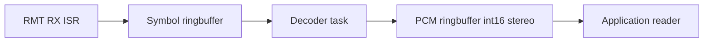

# ESP32 S/PDIF Input (RMT-based)

High-performance S/PDIF receiver implemented with the ESP-IDF RMT RX + DMA. It auto-discovers the input pulse timing, decodes bi-phase-mark encoded subframes, and produces interleaved 16-bit PCM stereo frames via a FreeRTOS ring buffer.

Key files:
- [include/spdif_in.h](include/spdif_in.h)
- [spdif_in.c](spdif_in.c)
- [histogram.h](histogram.h)
- [histogram.c](histogram.c)
- [idf_component.yml](idf_component.yml)

Supported targets and IDF:
- ESP-IDF [>= 5.4] as declared in [idf_component.yml](idf_component.yml)
- Targets: esp32s2, esp32s3, esp32p4, esp32 (see [idf_component.yml](idf_component.yml))


## Data Flow



## Features
- Auto timing discovery using pulse-width histogram and validation logic in [analyze_pulse_timing()](histogram.c#L89)
- LUT-driven symbol classification initialized by [decoder_init_thresholds()](spdif_in.c#L154)
- Zero-copy symbol transport via RMT DMA into a ring buffer, decoded on a dedicated task [spdif_decoder_task()](spdif_in.c#L190)
- Interleaved PCM output: writes [left,right] 16‑bit samples as a pair to the PCM ring buffer
- Sample-rate detection: [spdif_receiver_get_sample_rate()](spdif_in.c#L374) currently recognizes 48000 and 44100 Hz


## Hardware Notes
- Input is consumer S/PDIF; do not connect coax S/PDIF directly to a GPIO. Use an optical receiver module or a proper transformer/line receiver to 3.3 V logic.
- Choose any RMT-capable GPIO for the input pin; pass it to [spdif_receiver_init()](include/spdif_in.h#L46).


## Quick Start

1) Initialize and start the receiver

```c
#include "spdif_in.h"

static void on_ready(void) {
    // Optional callback when init completes
}

void app_start(void) {
    ESP_ERROR_CHECK(spdif_receiver_init(GPIO_NUM_4, on_ready)); // [spdif_receiver_init()](include/spdif_in.h#L46)
    ESP_ERROR_CHECK(spdif_receiver_start());                    // [spdif_receiver_start()](include/spdif_in.h#L47)
}
```

2) Wait for sample-rate lock and read PCM frames

```c
uint32_t sr = 0;
while ((sr = spdif_receiver_get_sample_rate()) == 0) {
    vTaskDelay(pdMS_TO_TICKS(10)); // [spdif_receiver_get_sample_rate()](spdif_in.c#L374)
}

// Either use the helper reader...
int16_t stereo[2];
int got = spdif_receiver_read((uint8_t*)stereo, sizeof(stereo)); // [spdif_receiver_read()](include/spdif_in.h#L56)

// ...or pull directly from the ring buffer for batched reads
size_t n = 0;
uint8_t* data = (uint8_t*) xRingbufferReceiveUpTo(
    spdif_in_get_ringbuf(), &n, pdMS_TO_TICKS(20), 1024); // [spdif_in_get_ringbuf()](include/spdif_in.h#L52)
if (data) {
    // data contains interleaved int16 little-endian [L,R] frames
    vRingbufferReturnItem(spdif_in_get_ringbuf(), data);
}
```

3) Stop and deinit if needed

```c
ESP_ERROR_CHECK(spdif_receiver_stop());   // [spdif_receiver_stop()](include/spdif_in.h#L48)
spdif_receiver_deinit();                  // [spdif_receiver_deinit()](include/spdif_in.h#L49)
```


## API Reference
- [spdif_receiver_init()](include/spdif_in.h#L46): Create PCM and symbol ring buffers, configure RMT RX on the given GPIO, register ISR callback, and spawn the decoder task.
- [spdif_receiver_start()](include/spdif_in.h#L47): Placeholder that currently returns OK once initialized.
- [spdif_receiver_stop()](include/spdif_in.h#L48): Disables the RMT channel.
- [spdif_receiver_deinit()](include/spdif_in.h#L49): Tears down RMT and buffers; safe to call after stop.
- [spdif_receiver_get_sample_rate()](spdif_in.c#L374): 0 until timing is discovered; then 48000 when base unit ticks is 13, 44100 when 14.
- [spdif_in_get_ringbuf()](include/spdif_in.h#L52): Returns the PCM ring buffer handle for direct access.
- [spdif_receiver_read()](include/spdif_in.h#L56): Convenience function to read up to `size` bytes from the PCM ring buffer.


## Configuration Constants
- [RMT_RESOLUTION_HZ](include/spdif_in.h#L10) default 80000000 for 80 MHz resolution
- [RMT_MEM_BLOCK_SYMBOLS](include/spdif_in.h#L11) number of RMT symbols in the DMA buffer
- [SYMBOL_BUFFER_SIZE](include/spdif_in.h#L12) capacity for the symbol ring buffer
- [PCM_BUFFER_SIZE](include/spdif_in.h#L13) bytes in the PCM output ring buffer
- [DECODER_TASK_STACK](include/spdif_in.h#L14) stack size for the decoder task
- [DECODER_TASK_PRIORITY](include/spdif_in.h#L15) task priority
- [MIN_SAMPLES_FOR_ANALYSIS](include/spdif_in.h#L16) histogram samples required before timing analysis


## Notes on Timing Discovery
- The histogram collector [collect_pulse_histogram()](histogram.c#L176) accumulates symbol durations until enough samples are seen.
- [analyze_pulse_timing()](histogram.c#L89) finds three pulse clusters with ratios near 1:2:3 and validates their distribution.
- Once valid, adaptive thresholds are computed and the decoder enables fast LUT classification via [decoder_init_thresholds()](spdif_in.c#L154).


## PCM Format
- Interleaved stereo little-endian int16 frames: [L0,R0,L1,R1,...]
- Producer writes a pair on each right-channel sample in [spdif_decoder_task()](spdif_in.c#L190)
- With [PCM_BUFFER_SIZE](include/spdif_in.h#L13)=4096, the buffer holds 1024 stereo frames (~21 ms at 48 kHz)


## Threading and Resources
- Decoder task created pinned to core 1 in [spdif_receiver_init()](spdif_in.c#L280) with priority [DECODER_TASK_PRIORITY](include/spdif_in.h#L15)
- RMT RX uses DMA with mem_block_symbols [RMT_MEM_BLOCK_SYMBOLS](include/spdif_in.h#L11) and restarts reception in ISR [rmt_rx_done_callback()](spdif_in.c#L253)


## Limitations
- Only 48 kHz and 44.1 kHz are reported by [spdif_receiver_get_sample_rate()](spdif_in.c#L374)
- Channel status/user data are not parsed; only 24-bit audio sample fields are decoded then downshifted to int16
- No slip/underrun recovery signaling to the application beyond normal ring buffer semantics


## Troubleshooting
- Sample rate stays 0: ensure valid S/PDIF signal and allow time to gather at least [MIN_SAMPLES_FOR_ANALYSIS](include/spdif_in.h#L16) symbols
- Empty reads: check that the consumer reads in multiples of 4 bytes and that [spdif_receiver_start()](include/spdif_in.h#L47) has been called
- Pin mapping: confirm the selected GPIO supports RMT RX on your target


## Version and Metadata
- Component version 1.0.0, repository [esp32-spdif-in](idf_component.yml#L14), commit placeholder [commit_sha](idf_component.yml#L7)
